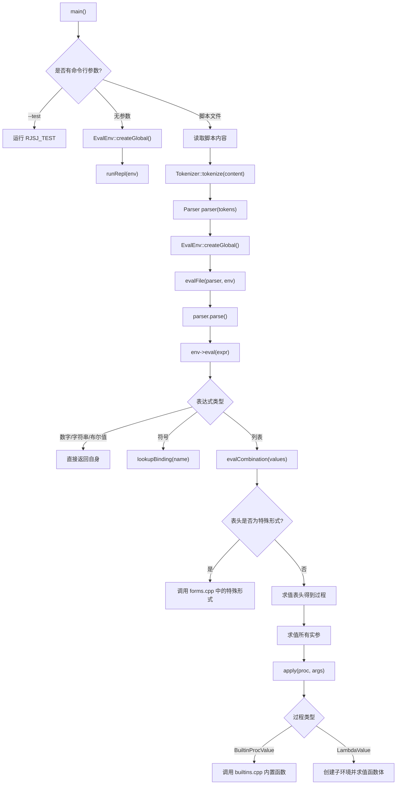

# Mini Lisp 解释器说明

## 项目简介

本项目是一个使用 C++ 实现的 Mini Lisp 解释器。它支持基本 Lisp 表达式的分词、解析、求值、词法作用域、用户自定义函数、特殊形式、内置过程、交互式 REPL，以及一个基于 Win32/GDI 的 2D 图形接口。

在当前版本中，解释器已经扩展了较丰富的数学函数、字符串函数、列表函数、高阶函数和图形绘制过程，并通过 `scripts/graphics_demo.scm` 实现了一个可点击、可判定胜负的黑白棋游戏。

## 目录说明

- `src/`：解释器源码。
- `scripts/`：示例 Lisp 脚本和测试脚本。
- `docs/`：项目文档。
- `bin/`：编译生成的可执行文件目录。
- `build/`：CMake 构建目录。
- `CMakeLists.txt`：CMake 构建配置。
- `.clang-format`：C++ 代码格式化规则。

更多文档：

- `docs/PROJECT_SUMMARY.md`：项目总说明。
- `docs/SRC_CPP_FILES.md`：`src` 下 `.cpp` 文件逐文件说明。
- `docs/GRAPHICS.md`：图形接口说明。

## 编译与运行

### 编译项目

```powershell
cmake --build build
```

### 运行测试

```powershell
bin\mini_lisp.exe --test
```

当前完整测试结果为：

```text
Total: 437/437
```

### 进入 REPL

```powershell
bin\mini_lisp.exe
```

示例：

```scheme
mini-lisp> (+ 1 2 3)
6
mini-lisp> (define (square x)
...           (* x x))
()
mini-lisp> (square 5)
25
```

REPL 支持多行输入、自动缩进、基础光标编辑和语法高亮。

### 运行脚本文件

```powershell
bin\mini_lisp.exe scripts\test.scm
```

运行黑白棋图形示例：

```powershell
bin\mini_lisp.exe scripts\graphics_demo.scm
```

## 代码运行示例

下面是一个简单 Lisp 程序：

```scheme
(define (sum-square a b)
  (+ (* a a) (* b b)))

(print (sum-square 3 4))
```

如果将其保存为 `scripts\example.scm`，可以通过以下命令执行：

```powershell
bin\mini_lisp.exe scripts\example.scm
```

输出结果为：

```text
25
```

这个例子会经历完整解释器流程：

1. 程序入口 `main()` 读取脚本文件内容。
2. `Tokenizer::tokenize(content)` 将源码切分为 token。
3. `Parser parser(std::move(tokens))` 创建解析器。
4. `EvalEnv::createGlobal()` 创建全局环境，并注册所有内置过程。
5. `evalFile(parser, env)` 循环解析并执行每个表达式。
6. `parser.parse()` 将 token 转换为 `Value` 表达式树。
7. `env->eval(expr)` 对表达式求值。
8. 遇到 `(define ...)` 时进入特殊形式处理，将 `sum-square` 绑定到环境中。
9. 遇到 `(print (sum-square 3 4))` 时，先求值函数调用，再调用内置过程 `print` 输出结果。

## 解释器调用流程透视

### 1. 程序入口

程序从 `src/main.cpp` 的 `main()` 开始。

当用户执行：

```powershell
bin\mini_lisp.exe scripts\example.scm
```

代码会进入脚本执行分支：

```cpp
std::ifstream file(argv[1]);
std::string content((std::istreambuf_iterator<char>(file)),
                    std::istreambuf_iterator<char>());
auto tokens = Tokenizer::tokenize(content);
Parser parser(std::move(tokens));
auto env = EvalEnv::createGlobal();
evalFile(parser, env);
```

这里最关键的步骤是：

- 读取文件。
- 分词。
- 创建解析器。
- 创建全局环境。
- 执行文件内表达式。

### 2. 创建全局环境

全局环境由 `EvalEnv::createGlobal()` 创建：

```cpp
std::shared_ptr<EvalEnv> EvalEnv::createGlobal() {
    auto env = std::shared_ptr<EvalEnv>(new EvalEnv());
    for (const auto& [name, func] : BUILTIN_FUNCTIONS) {
        env->symbols.emplace(name, std::make_shared<BuiltinProcValue>(func));
    }
    return env;
}
```

它会做两件事：

1. 创建一个新的 `EvalEnv`。
2. 遍历 `BUILTIN_FUNCTIONS`，把 `+`、`print`、`car`、`graphics-open` 等内置过程注册到全局符号表中。

因此，当 Lisp 代码写：

```scheme
(+ 1 2)
```

求值器才能在环境中找到 `+` 对应的 C++ 内置过程。

### 3. 分词

分词由 `Tokenizer::tokenize` 完成。

例如：

```scheme
(+ 1 2)
```

会被切成类似这样的 token：

```text
LEFT_PAREN
IDENTIFIER "+"
NUMERIC_LITERAL 1
NUMERIC_LITERAL 2
RIGHT_PAREN
```

该阶段只关心字符如何变成 token，不负责求值。

### 4. 解析

解析由 `Parser::parse()` 完成。

它会把 token 转换为解释器内部的 `Value` 树。例如：

```scheme
(+ 1 2)
```

会被解析成一个由 `PairValue` 串起来的列表结构，逻辑上等价于：

```scheme
(+ 1 2)
```

其中：

- `+` 是 `SymbolValue`。
- `1` 和 `2` 是 `NumericValue`。
- 整个列表由 `PairValue` 表示。

quote 简写也会在这里转换。例如：

```scheme
'x
```

会被解析为：

```scheme
(quote x)
```

### 5. 求值

求值由 `EvalEnv::eval()` 完成。它会根据表达式类型采取不同动作：

- 自求值对象：数字、字符串、布尔值直接返回自身。
- 符号：调用 `lookupBinding()` 在环境中查找绑定。
- 列表：调用 `evalCombination()` 处理组合式。
- 空列表：当前解释器禁止直接求值空列表。

核心逻辑是：

```cpp
ValuePtr EvalEnv::eval(ValuePtr expr) {
    if (expr->isSelfEvaluating()) {
        return expr;
    }

    if (expr->isNil()) {
        throw LispError("Evaluating nil is prohibited.");
    }

    if (auto name = expr->asSymbol()) {
        return lookupBinding(*name);
    }

    return evalCombination(expr->toVector());
}
```

### 6. 处理特殊形式

当表达式是列表时，求值器会先检查列表开头是不是特殊形式：

```scheme
(define x 10)
(if (> x 0) x (- x))
(lambda (x) (* x x))
```

这些不能像普通函数一样先求值全部参数，所以由 `forms.cpp` 中的特殊形式函数处理。

`EvalEnv::evalCombination()` 会先查 `SPECIAL_FORMS`：

```cpp
if (auto head = values.front()->asSymbol()) {
    auto iter = SPECIAL_FORMS.find(*head);
    if (iter != SPECIAL_FORMS.end()) {
        return iter->second(
            std::vector<ValuePtr>(values.begin() + 1, values.end()), *this);
    }
}
```

如果找到了，例如 `define`，就调用 `defineForm()`；如果没有找到，才按普通函数调用处理。

### 7. 普通函数调用

普通函数调用流程如下：

```cpp
auto proc = eval(values.front());
auto args = evalArguments(...);
return apply(std::move(proc), std::move(args));
```

也就是说，对：

```scheme
(+ (* 2 3) 4)
```

解释器会：

1. 求值 `+`，得到内置过程。
2. 求值 `(* 2 3)`，得到 `6`。
3. 求值 `4`，得到 `4`。
4. 调用 `apply()`。
5. `apply()` 发现目标是 `BuiltinProcValue`，于是调用对应 C++ 函数。
6. 最终执行 `add()`，返回 `10`。

### 8. 用户自定义函数调用

例如：

```scheme
(define (square x) (* x x))
(square 5)
```

执行流程是：

1. `defineForm()` 将 `square` 绑定为 `LambdaValue`。
2. 调用 `(square 5)` 时，先查找 `square` 得到 `LambdaValue`。
3. `apply()` 发现过程是 lambda，调用 `applyLambda()`。
4. `applyLambda()` 根据参数创建子环境。
5. 在子环境中绑定 `x = 5`。
6. 求值函数体 `(* x x)`。
7. 返回结果 `25`。

### 9. 流程图



## 常用内置过程示例

### 数学

```scheme
(+ 1 2 3)
(sqrt 9)
(max 1 5 3)
(gcd 18 24)
```

### 字符串

```scheme
(string-append "Mini" " " "Lisp")
(string-length "hello")
(substring "abcdef" 1 4)
(number->string 123)
(string->number "3.14")
```

### 列表与高阶函数

```scheme
(list 1 2 3)
(append '(1 2) '(3 4))
(map (lambda (x) (* x x)) '(1 2 3 4))
(filter odd? '(1 2 3 4 5))
(reduce + '(1 2 3 4 5))
```

### 图形

```scheme
(graphics-open 640 480 "demo")
(graphics-clear 255 255 255)
(graphics-color 0 0 0)
(graphics-line 10 10 200 100)
(graphics-refresh)
```

## 调试与开发建议

- 新增内置过程时，通常需要在 `builtins.cpp` 中实现函数，并加入 `BUILTIN_FUNCTIONS`。
- 新增特殊形式时，需要在 `forms.cpp` 中实现函数，并加入 `SPECIAL_FORMS`。
- 新增运行时值类型时，需要修改 `value.h` 和 `value.cpp`。
- 修改分词规则时，优先查看 `tokenizer.cpp`。
- 修改语法树构造规则时，优先查看 `parser.cpp`。
- 修改求值规则时，优先查看 `eval_env.cpp`。
- 修改 REPL 交互体验时，优先查看 `repl.cpp` 和 `line_editor.cpp`。
- 修改图形功能时，优先查看 `graphics.cpp` 和 `graphics.h`。

修改后建议运行：

```powershell
cmake --build build
bin\mini_lisp.exe --test
```
